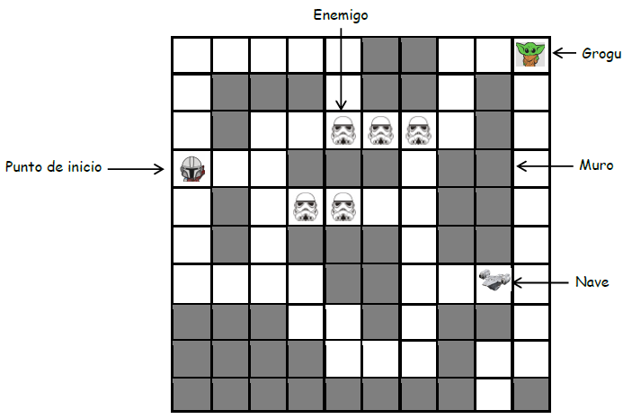
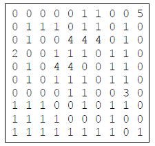

# Proyecto de curso: Smart Mandalorian
Inteligencia Artificial - Escuela de Ingeniería de Sistemas y Computación

## Profesores

- Profesor Oscar Bedoya

## Autores
- Nicolas Herrera - 2182551 [@Herreran903](https://github.com/Herreran903)
- Samuel Galindo - 2177491 [@SakyJoestar](https://github.com/SakyJoestar)
- Christian Vargas - 2179172 [@ChristianV2426](https://github.com/ChristianV2426)
- Jhon Belalcazar - 2182464 [@JohnFredd](https://github.com/JohnFredd)

## Smart Mandalorian

### El Problema

El objetivo de Mando es encontrar a Grogu en un espacio de 10x10 casillas usando algoritmos de inteligencia artificial. En el ambiente se tiene una nave que Mando puede usar para ir más rápido. También hay enemigos que afectan el estado del agente. Considere la siguiente abstracción del mundo representado por medio de una cuadrícula de 10x10.

En cada búsqueda que emprenda el agente podrá realizar desplazamientos simples tales como moverse arriba, abajo, izquierda, y derecha. Tenga en cuenta que el costo de cada movimiento es 1. Si Mando va en la nave, el costo de cada movimiento será 1/2 y además podrá pasar por las casillas donde haya enemigos sin que lo afecten. La nave solo tiene combustible para 10 casillas. Si Mando llega a una casilla donde hay un enemigo y no va en la nave, el costo será 5 (allí está incluido el costo del movimiento y del daño ocasionado por el enemigo). En el ambiente siempre hay una sola nave, pero la cantidad de enemigos puede variar.

La información del mundo se representa por medio de los siguientes números:

- 0 si es una casilla libre
- 1 si es un muro
- 2 si es el punto de inicio
- 3 si es la nave
- 4 si es un enemigo
- 5 si es Grogu

Por ejemplo, el mundo mostrado en la figura se representa mediante la matriz:

### El Proyecto

La apliacion permite:

- Ingresar los datos de un mundo determinado por medio de un archivo de texto que siga las convenciones dadas anteriormente.
- Desplegar gráficamente el mundo del agente en su estado inicial, es decir, tal como se lee del archivo.
- Seleccionar el tipo de algoritmo de búsqueda a aplicar: “No informada” ó “Informada”
- Si se selecciona búsqueda “No informada” se puede elegir entre “Amplitud”, “Costo uniforme” y “Profundidad evitando ciclos”.
- Si se selecciona búsqueda “Informada” se puede elegir entre “Avara” y “A*”.
- Una vez aplicado un algoritmo se muestra una animación en la interfaz gráfica con el conjunto de movimientos que realiza el agente.
- Después de aplicar un algoritmo se muestra un reporte con la siguiente información: cantidad de nodos expandidos, profundidad del árbol, y tiempo de cómputo. En el caso de los algoritmos de Costo y A* se muestra también el costo de la solución encontrada.
